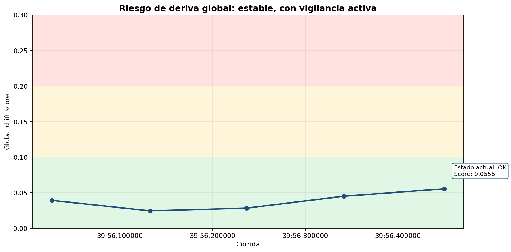
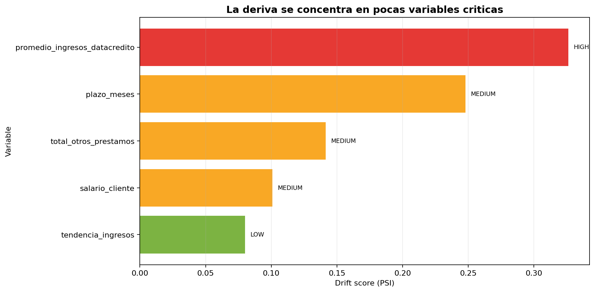
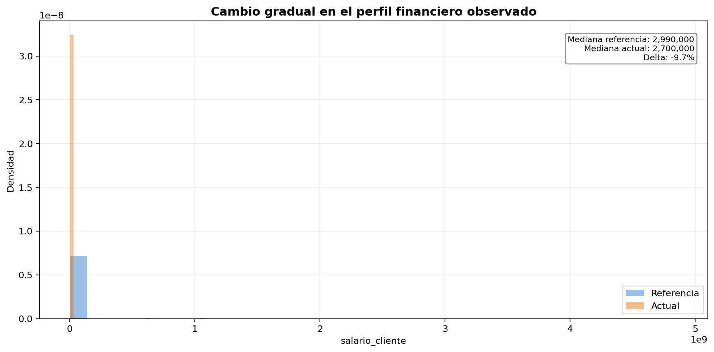
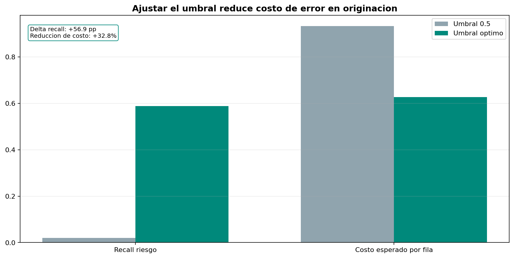

# Predicción de Comportamiento de Crédito

Este proyecto construye y opera un modelo de riesgo crediticio para anticipar el comportamiento de pago de nuevos clientes a partir de historicos de credito.

## Caso de negocio

En una entidad financiera, decidir bien en principio reduce perdidas por incumplimiento y mejora la asignación  de capital. El objetivo de esta solución es apoyar decisiónes de riesgo con evidencia cuantitativa, trazable y monitoreable en el tiempo.

Objetivos de negocio:
- Estimar riesgo de no pago para nuevos solicitantes.
- Mejorar decisiónes de aprobación y priorización de revisiones.
- Reducir degradacion silenciosa del modelo mediante monitoreo de drift.

## Objetivos analíticos

- Preparar y transformar datos de crédito con reglas reproducibles.
- Entrenar y evaluar modelos supervisados con métricas adecuadas para desbalance.
- Optimizar umbral de decisión con enfoque de costo.
- Monitorear cambios de población que puedan afectar desempeño.

## Principales hallazgos

- Se detecto y corrigio leakage en variables que producian métricas artificialmente perfectas.
- Al definir la clase positiva como evento de riesgo (no pago), las métricas se volvieron consistentes con el problema de negocio.
- El umbral por defecto 0.5 no era optimo para riesgo; la optimización por costo mejoro recuperación de eventos riesgosos.
- El monitoreo de drift se traduce en alertas tempranas para evitar deterioro silencioso del modelo.

Resumen ejecutivo de data drift:
- Hallazgo: estado global aceptable (ok) y drift agregado bajo en las corridas iniciales.
	Impacto: no se observa deterioro inmediato que comprometa decisiónes de origen.
	Accion: mantener operacion normal con monitoreo periódico.
- Hallazgo: no hay concentracion critica de variables en severidad alta.
	Impacto: estabilidad poblacional suficiente en la ventana evaluada.
	Accion: sostener seguimiento y confirmar consistencia en nuevas corridas.
- Hallazgo: variables financieras como total de otros prestamos, promedio de ingresos reportados y salario muestran mayor sensibilidad al cambio.
	Impacto: principal riesgo de mediano plazo por deriva gradual, no por ruptura abrupta.
	Accion: priorizar estas variables en el tablero y activar recalibración/retraining si la severidad aumenta de forma sostenida.

## Gráficas

1. Estabilidad global del modelo en el tiempo.
	- Riesgo de deriva global: estable, con vigilancia activa.
	- Estado actual OK; no hay evidencia de deterioro abrupto.
	- Recomendación: la situacion es estable hoy, pero debe vigilarse la tendencia.



2. Variables que explican el riesgo de deriva.
	- La deriva se concentra en pocas variables criticas.
	- El riesgo no es generalizado; se focaliza en variables financieras.
	- Recomendación: priorizar control sobre total de otros prestamos, ingresos y salario.



3. Evidencia de deriva gradual (sin ruptura).
	- Cambio gradual en el perfil financiero observado.
	- Se aprecia desplazamiento progresivo, no quiebre de poblacion.
	- Recomendación: el principal riesgo es acumulativo en el tiempo.



4. Impacto de decisión por umbral operativo.
	- Ajustar el umbral reduce costo de error en origen.
	- El umbral optimizado mejora captura de casos riesgosos.
	- Recomendación: la mejora no es solo estadística; impacta decisión de negocio.



## Descripcion del proceso

El flujo se ejecuta como una sola unidad operativa:

1. Carga y validacion de datos.
2. Analisis exploratorio y definicion de reglas de calidad.
3. Feature engineering reproducible.
4. Entrenamiento y evaluacion con auditoría.
5. Monitoreo continuo de drift y alertas.
6. Visualizacion ejecutiva para seguimiento de estabilidad.

## Componentes principales

- Carga inicial: src/Cargar_datos.ipynb
- EDA y reglas de calidad: src/Comprension_eda.ipynb
- Feature engineering: src/ft_engineering.py
- Entrenamiento y evaluacion: src/model_training_evaluation.py
- API de inferencia por lotes: src/model_deploy.py
- Monitoreo de drift: src/model_monitoring.py
- Dashboard de monitoreo: src/streamlit_monitoring_app.py
- Auditoría de entrenamiento: src/model_training_evaluation_audit.json
- Bundle de despliegue generado localmente: model_artifacts/credit_risk_model_bundle.joblib

## Ejecucion tecnica (resumen)

Primero activa el entorno virtual del proyecto.

Ejemplo con venv local:

```bash
source .venv/bin/activate
```

Si necesitas reconstruir entorno desde cero, usa:

```bash
bash setup.sh
```

Luego ejecuta los scripts principales:

```bash
python src/ft_engineering.py
python src/model_training_evaluation.py
python src/model_monitoring.py --batch-runs 5 --reset-history
python -m streamlit run src/streamlit_monitoring_app.py
```

## Despliegue del modelo

El entrenamiento exporta un bundle serializado en `model_artifacts/credit_risk_model_bundle.joblib`.
Ese artefacto se usa para levantar la API de predicción por lotes con FastAPI.
La imágen Docker usa solo dependencias de runtime definidas en `requirements-deploy.txt`.

Flujo recomendado:

1. Ejecutar entrenamiento para generar el bundle.
2. Construir la imágen Docker.
3. Levantar el contenedor y consumir `/predict` o `/predict/csv`.

Ejemplo:

```bash
python src/model_training_evaluation.py
docker build -t credit-risk-api .
docker run --rm -p 8000:8000 credit-risk-api
```

Uso directo de la imágen Docker:

1. Construye la imágen:

```bash
docker build -t credit-risk-api:slim .
```

2. Levanta el servicio:

```bash
docker run --rm -p 8000:8000 credit-risk-api:slim
```

3. Verifica que está arriba:

```bash
curl http://localhost:8000/health
```

4. Envía predicciones por lote en JSON:

```bash
curl -X POST http://localhost:8000/predict \
	-H "Content-Type: application/json" \
	-d '{"records":[{"tipo_credito":"4","capital_prestado":1000000,"plazo_meses":12,"edad_cliente":35,"tipo_laboral":"Empleado","salario_cliente":2500000,"total_otros_prestamos":300000,"cuota_pactada":120000,"puntaje_datacredito":780,"cant_creditosvigentes":2,"huella_consulta":4,"creditos_sectorFinanciero":1,"creditos_sectorCooperativo":0,"creditos_sectorReal":1,"promedio_ingresos_datacredito":2400000,"tendencia_ingresos":"Creciente","anio_prestamo":2026,"mes_prestamo":5,"dia_semana_prestamo":2,"ratio_deuda_ingreso":0.12,"ratio_cuota_ingreso":0.048}]}'
```

Endpoints principales:

- `GET /health` para verificar disponibilidad del bundle.
- `GET /metadata` para revisar configuración del artefacto.
- `POST /predict` para lotes en JSON.
- `POST /predict/csv` para lotes desde archivo CSV.

## Paso 5: Calidad de código con Sonar

Se agregó un pipeline de CI con Quality Gate:

- Workflow: `.github/workflows/ci-sonar.yml`

Quedó implementada una configuración mínima de SonarCloud como parte del pipeline de CI del proyecto, centralizada en un único archivo de workflow.

Requiere una configuración inicial mínima en GitHub y Sonar: mantener `SONAR_HOST_URL` y `SONAR_TOKEN` como secrets, sin exponer sus valores.

Esta implementación aporta certeza operativa al pipeline porque valida automáticamente, en cada push/PR a main/master, la compilación de scripts críticos, la construcción de la imagen Docker, el análisis estático y el Quality Gate de SonarCloud.

Qué valida el workflow:

- Compilación de scripts Python clave.
- Build Docker smoke test de la API.
- Análisis estático con Sonar.
- Validación de Quality Gate (pass/fail del pipeline).

## Interpretación de resultados

Para entrenamiento:
- Revisar src/model_training_evaluation_audit.json y su guia en src/model_training_evaluation_audit_guide.txt.
- Priorizar PR-AUC, recall de clase de riesgo y balanced accuracy sobre accuracy aislada.

Para monitoreo:
- Revisar src/monitoring_outputs/monitoring_summary_latest.json.
- Estado ok/warning/critical orienta acciones de seguimiento, recalibracion o retraining.
- Analizar tendencia en monitoring_history.csv para detectar cambios persistentes.

## Notas operativas

- Base_de_datos.csv es una fuente de ejemplo no productiva.
- Los artefactos de ejecucion de monitoreo no se versionan.
- En produccion, la ingestion y curacion de datos deben venir de procesos corporativos (DWH/Data Lake).
